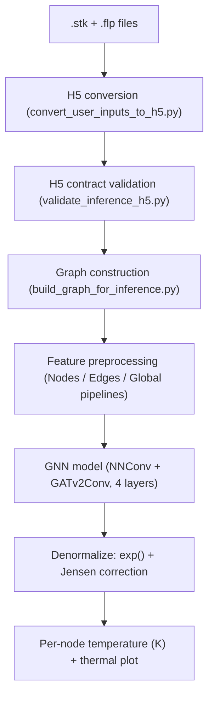
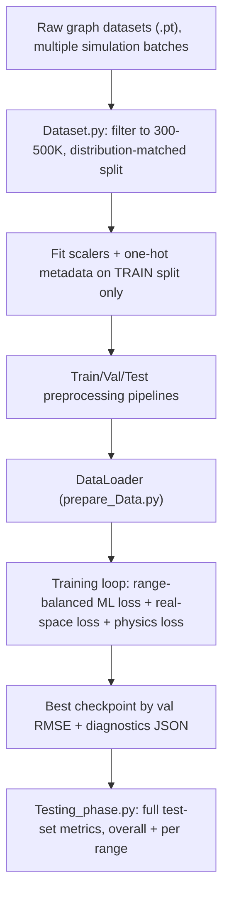
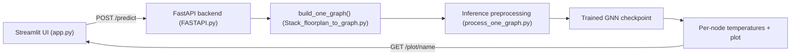
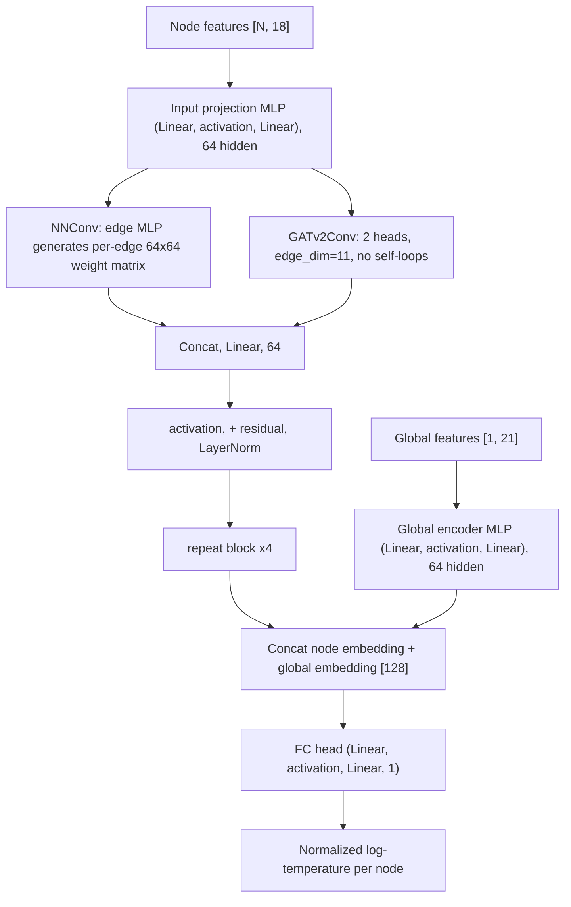

# 3D-IC Thermal Surrogate: A Physics-Informed Graph Neural Network for Chip Thermal Prediction

> Branding in the code (`app.py`) ties this project to **Si-Vision**. All facts below are drawn directly from the uploaded source files; anything the code does not make explicit is marked `[Needs clarification]` rather than guessed.

---

## 1. Project Overview

Modern 3D-IC (3D-stacked Integrated Circuit) packages — multiple silicon dies bonded vertically, connected through TSVs (Through-Silicon Vias), RDL layers, interposers, C4 bumps, and a package substrate — are notoriously hard to cool. Predicting the steady-state temperature of every functional block in a stack normally requires running a full physics-based thermal simulator (**3D-ICE**, referenced throughout the codebase's ground-truth extraction logic) on a detailed floorplan (`.flp`) and stack description (`.stk`). These simulations are accurate but slow, which makes them impractical for fast design-space exploration (e.g., "what if I move this hotspot block, change the cooling type, or add another TSV column?").

This project replaces that expensive simulator, for fast what-if exploration, with a **Graph Neural Network (GNN) surrogate model**: the 3D-IC stack is represented as a graph (blocks = nodes, thermal connections = edges, package/environment conditions = global features), and a custom message-passing network predicts the steady-state temperature of every block directly from the floorplan and stack description — in a fraction of the simulation time.

What makes this implementation technically interesting, beyond "GNN predicts temperature":
- **Physics-informed training**: the loss function includes a genuine energy-conservation constraint (predicted heat dissipated to ambient must match injected power), not just a data-fitting term.
- **Careful handling of a skewed, multi-regime target**: temperature is modeled in log-space, evaluated in real Kelvin space, and balanced across four temperature regimes with a *soft* (boundary-blended) weighting scheme rather than hard bins.
- **A documented, iterative engineering process**: the training script's own comments show a developer diagnosing a real overfitting episode (via a growing train/val RMSE gap) and responding with concrete, explained hyperparameter changes and a custom safety guard — not a single blind training run.
- **A train/serve-consistent inference pipeline**: the same `.stk`/`.flp` → H5 → graph contract is reused, byte-for-byte, between training-time dataset generation and live inference (`Stack_floorplan_to_graph.py` explicitly exists to guarantee this).

---

## 2. Problem Statement

- **Input**: a 3D-IC design description — one `.stk` (stack) file plus the `.flp` (floorplan) file for each layer it references, describing die layers, functional blocks (power density, area, position, material), TSVs, and packaging (cooling type, bonding, RDL/interposer/C4/substrate).
- **Output**: the steady-state temperature (K) of every block (node) in the stack.
- **Ground truth**: produced by running the actual 3D-ICE simulator and parsing its `tflp_*.txt` output files (per-block average steady-state temperature), via `Extract_ground_truth_temperatures.py`.
- **Why a surrogate model**: once trained, the GNN produces the same per-block temperature map in a single forward pass instead of a full physics simulation, making rapid design iteration and thermal-risk screening practical.

---

## 3. System Architecture

### 3.1 High-Level Pipeline

### 3.2 Training Pipeline

### 3.3 Serving Pipeline

---

## 4. Data Pipeline

### 4.1 Graph Representation

Each 3D-IC design becomes one `torch_geometric.data.Data` graph:

| Element | Meaning | Raw feature count |
|---|---|---|
| **Node** | One physical block: a real functional block, a filler block, or a TSV pad used as a node | 13 features: `power_density_W_mm2`, `area_mm2`, `layer_idx`, `kappa_W_mK`, `block_type_code`, `has_tsv`, `is_hotspot`, `x/y/z_center_mm`, `width_mm`, `height_mm`, `exposed_area_mm2` |
| **Edge** | A thermal connection between two blocks — lateral (same layer) or vertical (cross-layer / TSV) | 11 features: `thermal_resistance`, `vertical_lateral`, `geometric_distance`, `delta_z`, `contact_overlap_area`, `conductivity`, `thermal_conductance`, `edge_type`, `thermal_path_length`, `material_path`, `physical_path_info` |
| **Global (graph-level)** | Package and environment context, shared by every node in the graph | 27 features: ambient temperature, workload factor, total power, layer count, TSV pair count, hotspot info, cooling type/HTC, package recipe, bond/RDL/interposer/C4/substrate thickness & conductivity, chip width/height |
| **Target `y`** | Steady-state temperature (K) per node, from 3D-ICE ground truth | Range constrained to 300-500 K during dataset curation |

### 4.2 Dataset Assembly (`Dataset.py`)

1. Loads several pre-generated physics-simulation graph datasets (`.pt` files) — including targeted batches specifically covering the 400-500 K high-temperature regime, indicating the raw data was deliberately supplemented to avoid under-representing hot, high-risk designs.
2. Filters out any graph containing a node temperature outside **300-500 K**.
3. Searches **100 random seeds** for a train(80%)/val(10%)/test(10%) split whose per-range temperature *distributions* (300-350, 350-400, 400-450, 450-500 K) match each other as closely as possible — an explicit guard against distribution shift between splits, rather than a single arbitrary `train_test_split` call.
4. Fits `StandardScaler`s **on the training split only** for every continuous feature (with `log1p` applied first to skewed, strictly-positive quantities: area, kappa, exposed area, resistance, contact area, thermal path length, total power, cooling HTC, bond kappa, TSV pair count, hotspot multiplier).
5. Fits a **log-space** scaler on the target temperature itself (`log(T)` then `StandardScaler`) — the model is trained to predict normalized log-temperature, not raw Kelvin.
6. Records one-hot cardinalities (number of layers, block types, edge types, cooling types, package recipe codes).
7. Persists every scaler and cardinality via `joblib` so training, validation, testing, and live inference all apply **identical** transforms.

### 4.3 Per-Graph Preprocessing (three parallel implementations)

| File | Used for |
|---|---|
| `Train_data_processin.py`, `Val_data_processing.py`, `Test_data_processing.py` | Batch preprocessing of the full train/val/test datasets before training (looping over a list of graphs) |
| `process_one_graph.py` | The same transforms applied to a single graph at inference time (no loop) |

Each performs three stages:
- **Nodes**: scales power/area/kappa/exposed-area, one-hot-encodes layer index and block type, and adds five engineered scale-invariant features — `relative_depth` (layer position normalized), `relative_width`/`relative_height` (block size relative to chip size), and `relative_x`/`relative_y` (block position relative to chip size) — so the model generalizes across chips of different physical dimensions.
- **Edges**: scales resistance/distance/contact-area/path-length, one-hot-encodes edge type.
- **Global**: two versions exist — an older `..._pipleline` (6 kept features) and the current `..._pipleline_new` (11 kept features, adding ambient temperature, workload factor, TSV pair count, and hotspot multiplier as modeled features, plus chip width/height and a package-recipe one-hot). Both compute an engineered feature, **`R_pkg`**, the sum of thickness / conductivity for the RDL, interposer, C4, and substrate layers — a direct 1-D thermal-resistance approximation for the whole package stack-up: a physically meaningful engineered feature, not a purely statistical one.

---

## 5. Model Architecture

Defined identically (module name `ML_only_model`) across `FASTAPI.py`, `Final_app.py`, and `Training_v1_playground.py`, with one activation difference noted in Section 9.

- **Why NNConv + GATv2 together**: NNConv lets each edge's own features (thermal resistance, distance, conductance...) directly generate the weight matrix used to pass a "thermal message" between two nodes — a natural inductive bias for heat conduction, where resistance should govern how strongly one block influences its neighbor's temperature. GATv2 adds a learned-attention channel on top, letting the model also weigh neighbors by relevance rather than relying purely on the hand-designed edge-conditioned transform.
- **Residual + LayerNorm** after every message-passing block stabilizes training across 4 stacked layers (mitigating over-smoothing, a known failure mode of deep GNNs).
- **Global context fusion**: package/cooling/ambient conditions are encoded once per graph and concatenated onto every node's final embedding before the prediction head, so identical blocks in two different packages (different cooling, different ambient temperature) can still be predicted differently.
- **Configuration** (`CONFIG` in the training/inference scripts): `in_features=18`, `in_features_edge=11`, `global_features=21`, `hidden_features=64`, `edge_mlp_hidden=32`, `num_layers=4`, `gat_heads=2`.
- **Trainable parameter count**: printed at training/inference start (`num_params` / `print("Model : ", model)`) but not recorded in any uploaded file — `[Needs clarification / fill in from your own logs]`.

---

## 6. Physics-Informed Training

Implemented in `Training_v1_playground.py`. This is the most technically distinctive part of the project.

### 6.1 Loss Function

Total loss = **ML loss** (normalized log-space) + **real-space loss** (Kelvin, weighted) + **physics loss** (weighted, warmed up):

| Component | Class | What it does |
|---|---|---|
| ML loss | `RangeBalancedMLLoss` | MSE in normalized log-temperature space, averaged **per temperature range** rather than per node, so the 4 regimes (300-350 / 350-400 / 400-450 / 450-500 K) contribute equally regardless of how many nodes fall in each — countering the natural imbalance where most nodes sit at moderate temperatures |
| Real-space loss | `RangeBalancedRealSpaceLoss` | Huber loss computed directly in Kelvin (scaled by 30 K), same per-range balancing — keeps the optimization anchored to physically meaningful error magnitudes, not just log-space residuals |
| Physics loss | `calculate_global_energy_loss` | Enforces **global energy conservation** per graph: total predicted heat leaving to ambient (`G_amb x (T_pred - T_ambient)`, summed over nodes) must equal total injected power, for graphs flagged `pinn_global_energy_eligible`. The normalized residual is squared and averaged only over eligible graphs. |

**Soft range weighting** (`soft_range_weights`): rather than hard-assigning each node to exactly one of the 4 ranges, nodes within a configurable margin (`boundary_margin_K = 10 K`) of a range boundary are linearly blended between the two neighboring ranges. This avoids a training-time discontinuity exactly at 350/400/450 K, where a hard cutoff would otherwise create a sharp jump in which loss term "owns" a node.

**Physics-loss warmup**: `lambda_physics` ramps linearly from 0 to its target (0.05) over the first 20 epochs, so the physics constraint doesn't destabilize training before the data-fitting terms have learned anything useful.

### 6.2 Log-Normal (Jensen) Correction

The model is trained to predict `log(T)` in normalized space. Converting back via `exp()` alone is statistically biased low, by Jensen's inequality (E[exp(X)] >= exp(E[X]) for a random variable X). The code corrects this at validation/inference time by adding `0.5 x variance(log-residual)` to the log-prediction before exponentiating (`apply_jensen_correction`) — and estimates that variance **separately for each of the 4 temperature ranges** (`estimate_jensen_sigma_per_range`), since residual noise is not assumed uniform across the whole temperature domain.

### 6.3 Overfitting Diagnosis and Guard

The `CONFIG` dictionary's comments document a real diagnosed failure: the train/val RMSE gap grew monotonically across a prior run (1.86% -> 6.67% -> 14.11% -> 21.47%) while validation RMSE was still barely improving — meaning standard RMSE-based early stopping did **not** catch the overfitting. In direct response, two changes are documented and explained in-line:
- `weight_decay` increased from `1e-4` to `3e-4`.
- `lambda_physics`'s final value halved from `0.1` to `0.05` (every prior stability regression coincided with the physics term reaching full strength at epoch 15).

A **second, independent stopping mechanism** was added beyond ordinary early stopping (`early_stopping_patience = 12`): training hard-stops if the train/val RMSE gap exceeds `max_safe_train_val_gap_pct = 25%` at any epoch after physics warmup plus a 10-epoch buffer — because RMSE-based early stopping alone had already been shown, on this exact project, to miss a real memorization episode.

### 6.4 Optimization Setup

| Setting | Value |
|---|---|
| Optimizer | AdamW |
| Learning rate | 1e-3 |
| Weight decay | 3e-4 |
| Gradient clipping | norm 35 |
| LR scheduler | `ReduceLROnPlateau` (factor 0.5, patience 1 epoch), tracks validation RMSE |
| Max epochs | 200 |
| Early stopping patience | 12 epochs |
| Batch size | 8 in the training script's `CONFIG`; `prepare_Data.py`/`Dataset.py` build loaders with 8/16 depending on which script created them — `[Needs clarification: confirm which loader the presented checkpoint trained on]` |
| Seed | 42 |

### 6.5 Iteration History

The training config's comments list a real progression of checkpoints: `ML_with_physics_model_range_balanced.pt` -> `hard_finetuned` -> `hard_finetuned_x3` -> `hard_finetuned_super_power` -> `ultra_super_power_V2000.pt` -> `Model_v1_playground.pt` through `Model_v7_playground.pt` (commented "Best one till now"). This is worth being able to speak to directly in an interview: it shows iterative, diagnosis-driven model development rather than a single training run.

---

## 7. Evaluation

Implemented in `Testing_phase.py`, run against the held-out test split (`loaders["test"]`), never used during training or Jensen-variance estimation.

**Metrics computed:**
- Overall RMSE, MAE, bias, max absolute error (Kelvin), across every node in the test set.
- Error-threshold coverage: percentage of nodes with |error| > 5 K, > 8 K, > 10 K.
- The same metrics **broken down per temperature range** (300-350 / 350-400 / 400-450 / 450-500 K), plus per-range >8 K and >10 K error percentages — this is the metric set that actually matters for a design tool, since a model that is accurate on average but poor specifically in the hottest (highest-risk) range would be misleading if only overall RMSE were reported.

**Your actual numbers** (fill in from your own `Model_v7_playground.json` / test run output before presenting — no final metric values were present in the uploaded code, so none are fabricated here):

| Metric | Value |
|---|---|
| Overall RMSE (K) | `[fill in]` |
| Overall MAE (K) | `[fill in]` |
| Overall Bias (K) | `[fill in]` |
| Max Error (K) | `[fill in]` |
| % nodes with error > 8 K | `[fill in]` |
| % nodes with error > 10 K | `[fill in]` |
| Test graphs / total nodes | `[fill in]` |

---

## 8. Serving & Application

### 8.1 Inference Graph Construction — Train/Serve Consistency

`Stack_floorplan_to_graph.build_one_graph()` is a deliberate, single-purpose wrapper: given a folder with one `.stk` and its `.flp` files, it chains three independently-audited scripts — `convert_user_inputs_to_h5.build_v3_h5` -> `validate_inference_h5.validate_sim` -> `build_graph_for_inference.build_graph` — using the same reference contract (`build_graph_PINN_ready_final_cohort_gated.py`) that built the training data, specifically to keep inference-time graphs byte-identical in structure to training-time graphs. This directly avoids train/serve skew, a common real-world failure mode in ML systems.

### 8.2 API (`FASTAPI.py`)

| Endpoint | Method | Input | Output |
|---|---|---|---|
| `/predict` | POST | Uploaded `.stk` + `.flp` files | JSON: `status`, `num_nodes`, `min/max/mean_temperature_K`, full per-node `temperatures_K` list, `plot_name` |
| `/plot/{plot_name}` | GET | Plot filename | The generated thermal plot image |

Internally: saves uploads to a temp directory -> `build_one_graph()` -> the same three-stage preprocessing pipeline used in training (`Train_Nodes_data_pipleline`, `Train_Edges_data_pipleline`, `Train_Global_data_pipleline_new`) -> model forward pass -> `exp()` + Jensen-correction denormalization -> `plot_graph()` renders and saves the visualization -> JSON response.

`[Needs clarification]`: `FASTAPI.py` defines its own copy of `ML_only_model` using `ReLU` and loads `ML_with_physics_model_ultra_super_power_V2000.pt`, while `Final_app.py` (imported elsewhere as `Backend.Final_app`) defines the same class using `LeakyReLU` and loads the newer `Model_v7_playground.pt` — matching the activation actually used in `Training_v1_playground.py`. These two files currently disagree on which checkpoint is "production." Worth resolving which is the live one before presenting this as a single coherent deployment.

### 8.3 Frontend (`app.py`)

A Streamlit app, titled "3D-IC Thermal Prediction" with Si-Vision branding: drag-and-drop `.stk`/`.flp` upload, a "Run Thermal Model" button that POSTs to the FastAPI backend, and a results view showing the generated plot, min/mean/max temperature, and the full per-node temperature list.

### 8.4 Validation Utility

`Test_inference_mode.py` and `Extract_ground_truth_temperatures.py` together form the developer's own end-to-end sanity check: build a graph for one real, previously-simulated design, extract its true 3D-ICE ground truth (parsed from `tflp_*.txt` files, matched to graph node order with an explicit two-pass real-then-filler ordering rule to avoid silently comparing the wrong nodes), run the model, and visualize prediction vs. ground truth side by side.

---

## 9. Visualization (`plot_predictionsVSGroundTruth.py`)

A purpose-built diagram, not a generic scatter plot:
- Lays nodes out as a 2D projection, grouping them into labeled columns by die/layer when 3D position data is available.
- Draws lateral (within-layer) edges solid and vertical/cross-layer (TSV) edges faint, so the stack structure reads clearly instead of as a dense mesh.
- Colors nodes by temperature using a 1st-99th percentile color range computed from valid, non-zero values only — so a few bad/zero readings don't wash out the color scale for everything else.
- Prints both ground truth (top) and prediction (bottom) inside each node when both are available.
- Draws a red ring around any node whose absolute error exceeds a configurable threshold (default 10 K) for immediate visual triage of the model's worst predictions.
- Explicitly warns in the console if any temperature value is exactly zero, flagging it as a likely data issue rather than silently plotting it.
- Reports RMSE / MAE / max error / bias for the plotted graph directly in the title.

---

## 10. Technologies Used

| Technology | Purpose |
|---|---|
| PyTorch | Core tensor/autograd framework |
| PyTorch Geometric (`torch_geometric`) | Graph data structures (`Data`, `DataLoader`), `NNConv`, `GATv2Conv` |
| scikit-learn | `StandardScaler` for all continuous features and the log-space target; `train_test_split` for the distribution-matched split search |
| h5py | Reading/validating the intermediate H5 representation of a design |
| joblib | Persisting scalers, one-hot metadata, and preprocessed chunk/graph lists |
| FastAPI | Inference API (`/predict`, `/plot/{name}`) |
| Streamlit | Frontend upload-and-visualize UI |
| Matplotlib | Custom thermal-map visualization |
| pandas / numpy | Feature-table construction and statistics during dataset assembly |

---

## 11. Known Gaps / Items to Resolve Before the Interview

Being able to speak to these directly is itself a strength — it shows you understand your own system's current state, not just its happy path.

1. **Two divergent model/checkpoint configurations** in `FASTAPI.py` vs. `Final_app.py` (Section 8.2) — decide and be ready to state which is actually deployed.
2. **Final test-set metrics** are not embedded in any uploaded script — pull them from your own `Model_v7_playground.json` / test-run output before presenting (Section 7).
3. **Trainable parameter count** is printed at runtime but not recorded anywhere static — grab it from your training logs.
4. **Batch size discrepancy**: `prepare_Data.py`/`Dataset.py` build loaders with `batch_size=8`/`16` depending on which script created them, while `Training_v1_playground.py`'s `CONFIG["batch_size"] = 8` — confirm which loader (and therefore which batch size) the presented checkpoint actually trained on.
5. `convert_user_inputs_to_h5.py`, `build_graph_for_inference.py`, and `build_graph_PINN_ready_final_cohort_gated.py` were referenced by other scripts but not included in this documentation pass — if asked in detail about the `.stk`/`.flp` -> H5 -> graph conversion internals, have those files ready to walk through.
